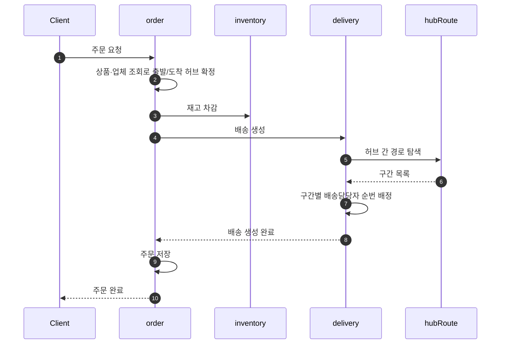
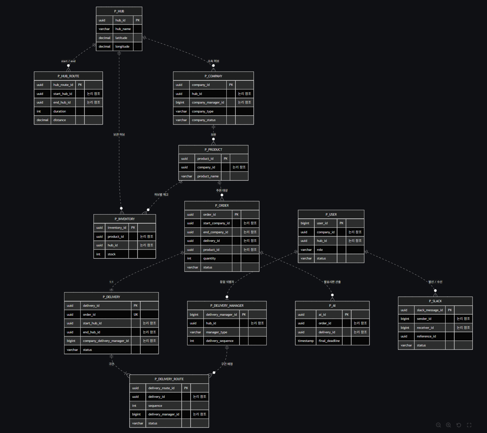

<div align="center">

# 물류 관리 및 배송 시스템

MSA 기반 물류 관리 플랫폼

주문이 들어오면 허브 간 최단 경로를 계산해 배송을 생성하고,<br/>
배송담당자를 자동 배정해 구간별로 이송 상태를 추적합니다.

<br/>


</div>

<br/>

## 프로젝트 목적

대규모 트래픽을 가정한 물류 관리 플랫폼을 **MSA로 설계·구현**하는 것을 목표로 합니다.

- 도메인 경계를 나누고 서비스 간 의존을 어떻게 최소화할 것인가
- 여러 서비스에 걸친 트랜잭션의 정합성을 어떻게 보장할 것인가
- 인증/인가를 서비스마다 중복 구현하지 않으려면 어디에 두어야 하는가
- 요청이 여러 서비스를 거칠 때 장애 지점을 어떻게 추적할 것인가

<br/>

## 시스템 구성

```
Client ──JWT──▶ Gateway ──X-User-Id / X-User-Role / X-Hub-Id / X-Company-Id──▶ 도메인 서비스
                 19091
```

Gateway가 JWT를 한 번 검증하고, 내부 서비스가 사용할 인증 정보를 헤더로 주입합니다.
모든 서비스는 `eureka-server`에 등록되어 서로를 탐색하며, 요청 트레이스는 Zipkin으로 수집됩니다.

| 서비스 | 포트 | 설명 |
| :--- | :---: | :--- |
| `eureka-server` | 19090 | 서비스 레지스트리 |
| `gateway-service` | 19091 | 라우팅, JWT 검증, 인증 헤더 주입 |
| `user-service` | 19092 | 회원가입/로그인, 가입 승인, 권한 및 소속 관리 |
| `order-service` | 19093 | 주문 생성/취소, Saga 오케스트레이션 |
| `product-service` | 19094 | 상품 관리 |
| `delivery-service` | 19096 | 배송, 배송경로, 배송담당자 관리 |
| `hub-service` | 19097 | 허브 관리 |
| `inventory-service` | 19098 | 재고 관리 |
| `company-service` | 19099 | 업체 관리 |
| `hubRoute-service` | 19100 | 허브 간 경로 관리 및 최단 경로 탐색 |
| `slack-service` | 19101 | 알림 발송 및 발송 이력 관리 |
| `ai-service` | 19102 | 발송 시한 산출 |

**권한** &nbsp;·&nbsp; `MASTER` `HUB_MANAGER` `HUB_DELIVERY_MANAGER` `COMPANY_MANAGER` `COMPANY_DELIVERY_MANAGER`

<br/>

## 도메인 흐름

주문 한 건이 처리되는 과정에 여러 서비스가 관여합니다.



이후 배송은 다음 순서로 진행됩니다.

| 단계 | 상태 전이 | 수행 주체 |
| :--- | :--- | :--- |
| 구간 이송 시작 | `HUB_WAITING` → `HUB_MOVING` | 허브 배송담당자 |
| 구간 도착 | 구간별 `DEST_HUB_ARRIVED` | 허브 배송담당자 |
| 마지막 구간 도착 | → `COMPANY_MOVING` (업체 담당자 자동 배정) | 시스템 |
| 배송 완료 | → `DELIVERED` | 업체 배송담당자 |

> [!NOTE]
> 구간은 순서대로만 진행할 수 있으며 건너뛸 수 없습니다.
> 중간에 실패하면 앞 단계를 되돌립니다. 배송 생성이 실패하면 차감된 재고를 복구하고, 주문 저장이 실패하면 배송을 취소한 뒤 재고를 복구합니다.

<br/>

## 주요 구현 내용

<details>
<summary><b>Edge Authentication</b> — 인증을 Gateway 한 곳에서만</summary>

<br/>

JWT 검증을 Gateway에서 한 번만 수행하고, 결과를 신뢰된 헤더(`X-User-Id`, `X-User-Role`, `X-Hub-Id`, `X-Company-Id`)로 내부 서비스에 전달합니다.
서비스마다 토큰 파싱을 중복 구현하지 않고, 키 교체 시 Gateway만 바꾸면 됩니다.

클라이언트가 인증 헤더를 위조해 보내는 경우를 막기 위해, Gateway가 해당 헤더를 먼저 제거한 뒤 검증 결과로 덮어씁니다.

</details>

<details>
<summary><b>분산 트랜잭션 (Saga)</b> — 실패 시 역순 보상</summary>

<br/>

주문 생성은 `재고 차감 → 배송 생성 → 주문 저장` 순서로 진행되는 분산 트랜잭션입니다.
오케스트레이션 방식으로 각 단계를 실행하고, 실패 시 이미 성공한 단계를 역순으로 보상합니다.

같은 요청이 재시도될 때 재고가 두 번 차감되지 않도록 멱등 키를 Redis에 두었고, 요청 단위 식별자와 개별 재고 작업 식별자를 분리해 "이미 보상된 작업을 성공으로 응답"하는 문제를 막았습니다.

</details>

<details>
<summary><b>허브 간 최단 경로 탐색</b> — 다익스트라</summary>

<br/>

출발 허브와 도착 허브가 직접 연결되어 있지 않아도 배송이 가능해야 합니다.
등록된 허브 경로 전체로 그래프를 구성하고, **다익스트라 알고리즘**으로 소요 시간 기준 최단 경로를 계산합니다.

너비 우선 탐색은 최소 경유지만 찾을 뿐 가중치를 반영하지 못하므로, 소요 시간·거리를 비용으로 다루기 위해 다익스트라를 선택했습니다.
직통 경로가 이미 등록되어 있으면 탐색 없이 그대로 반환합니다.

</details>

<details>
<summary><b>배송담당자 순번 배정</b> — 비관적 락으로 중복 방지</summary>

<br/>

배송담당자는 등록 순번에 따라 순환 배정됩니다.
동시에 여러 배송이 생성될 때 같은 담당자가 중복 배정되지 않도록, 배정 상태 조회에 비관적 락(`SELECT ... FOR UPDATE`)을 걸어 채번을 직렬화했습니다.

배정 상태 행은 담당자 등록 시점에 미리 만들어, 배송 생성 중에 행 생성 경합이 발생하지 않도록 했습니다.

</details>

<details>
<summary><b>가입 승인 절차</b> — 권한은 관리자가 부여</summary>

<br/>

회원가입은 즉시 활성화되지 않고 `PENDING` 상태로 시작합니다.
관리자가 승인하면 `APPROVED`가 되어 로그인할 수 있고, 거절하면 `REJECTED`로 남습니다.

권한과 소속(허브·업체)은 사용자가 스스로 정하는 값이 아니라 관리자가 부여하는 값이므로, 가입 요청과 승인을 분리했습니다.

</details>

<details>
<summary><b>이벤트 기반 알림</b> — 커밋 이후 발행, 실패 시 재발송</summary>

<br/>

알림은 트랜잭션 커밋 이후에 발행됩니다. 커밋 전에 발행하면 롤백된 작업의 알림이 나가버리기 때문입니다.

발송 결과를 이력으로 남겨, 실패한 알림은 원인을 확인하고 재발송할 수 있습니다.

</details>

<details>
<summary><b>서비스 간 통신</b> — 포트-어댑터로 격리</summary>

<br/>

서비스 간 호출은 포트-어댑터 구조로 감싸, 애플리케이션 계층이 Feign에 의존하지 않도록 했습니다.
외부 서비스 장애는 어느 서비스가 실패했는지 구분되는 에러로 변환해 응답합니다.

</details>

<details>
<summary><b>분산 추적</b> — 하나의 트레이스로 묶기</summary>

<br/>

요청이 여러 서비스를 거치므로, Micrometer Tracing과 Zipkin으로 하나의 트레이스로 묶어 어느 구간에서 지연·실패가 발생했는지 확인할 수 있게 했습니다.

</details>

<!-- TODO: 각 담당자분들 — 본인 서비스에서 다룬 내용을 위 형식으로 추가·보완해주세요.
     (특히 AI 연동, 상품/업체 검색, 재고 관리 부분) -->

<br/>

## 기술 스택

| 구분 | 기술 |
| :--- | :--- |
| Language | Java 21 |
| Framework | Spring Boot 4.1.0 |
| MSA | Spring Cloud 2025.1.2 — Eureka, Gateway, OpenFeign, LoadBalancer |
| Persistence | Spring Data JPA, PostgreSQL 17 |
| Query | QueryDSL <sub>(company)</sub> |
| Cache | Redis 7 <sub>(order, inventory, hubRoute)</sub> |
| Messaging | RabbitMQ 3 <sub>(order, hub, hubRoute, slack, ai)</sub> |
| Auth | JWT (jjwt), Spring Security |
| Observability | Micrometer Tracing, Brave, Zipkin |
| Docs | springdoc-openapi |
| Build | Gradle 8.14, 멀티 모듈 |

<br/>

## 실행 방법

### 1. 환경 변수

```bash
cp .env.example .env
```

| 키 | 설명 |
| :--- | :--- |
| `POSTGRES_USER` `POSTGRES_PASSWORD` `POSTGRES_DB` | DB 컨테이너 초기화 |
| `DB_HOST` `DB_USERNAME` `DB_PASSWORD` | 애플리케이션 DB 접속 |
| `REDIS_HOST` `RABBITMQ_HOST` `RABBITMQ_USERNAME` `RABBITMQ_PASSWORD` | 미들웨어 접속 |
| `JWT_SECRET` | HMAC 대칭키. 최소 32바이트, user-service와 gateway가 동일해야 함 |
| `MASTER_USERNAME` `MASTER_NAME` `MASTER_PASSWORD` `MASTER_SLACK_ID` | 최초 MASTER 계정 |
| `SLACK_WEBHOOK_URL` | 알림 발송 |

### 2. 인프라 기동

```bash
docker compose up -d
```

PostgreSQL, Redis, RabbitMQ, Zipkin이 뜹니다.
DB 스키마는 `infra/postgres/*.sql`이 컨테이너 최초 생성 시 1회 실행됩니다.

> [!NOTE]
> 스키마를 변경했다면 `docker compose down -v`로 볼륨까지 지운 뒤 다시 올려야 반영됩니다.

### 3. 애플리케이션 기동

```bash
./gradlew build
```

`eureka-server` → `gateway-service` → 나머지 순서로 실행합니다.

### 4. 확인

| 대상 | 주소 |
| :--- | :--- |
| Eureka 대시보드 | http://13.124.49.114:19090 |
| Zipkin | http://13.124.49.114:9411 |
| RabbitMQ 관리 콘솔 | http://13.124.49.114:15672 |

MASTER 계정은 user-service 기동 시 `.env` 값으로 자동 생성됩니다.
모든 API 요청은 Gateway(19091)를 통합니다.

```bash
curl -X POST http://localhost:19091/api/v1/auth/login \
  -H "Content-Type: application/json" \
  -d '{"username":"...","password":"..."}'
```

<br/>

## ERD



<br/>

## API 문서

Swagger UI가 적용된 서비스입니다. 권한별 접근 범위는 `@Operation`의 description에 명시되어 있습니다.
http://13.124.49.114:19091/swagger-ui.html

<br/>

## 팀원

| 이름 | 담당 |
| :--- | :--- |
| 김정석 | User |
| 서주성 | Company, Product, AI |
| 정수민 | Delivery, 인프라 (Eureka / Gateway) |
| 정승호 | Hub, HubRoute |
| 최한솔 | Order, Inventory, Slack |