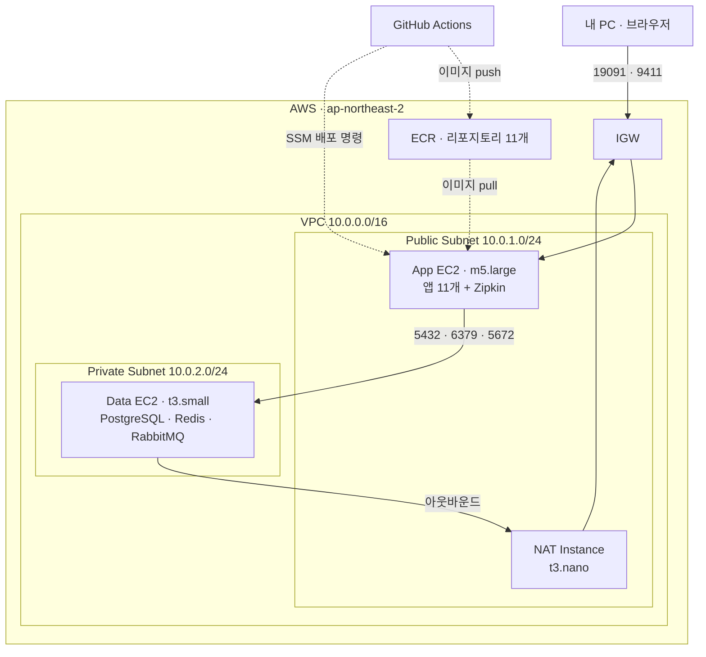

# 물류 관리 및 배송 시스템 (Sparta Logistics)

## 팀원 및 역할분담
| 이름 | 담당 |
|---|---|
| | 인프라 / User / Slack |
| | Order / Inventory |
| | Delivery |
| | Hub |
| | Company / Product |

## 서비스 구성

| 모듈 | 포트 | 역할 |
|---|---:|---|
| `eureka-server` | 19090 | 서비스 레지스트리 |
| `gateway-service` | 19091 | 외부 진입점. JWT 검증 후 사용자 헤더 주입 |
| `user-service` | 19092 | 회원가입·로그인·승인 |
| `order-service` | 19093 | 주문 |
| `product-service` | 19094 | 상품 |
| `delivery-service` | 19096 | 배송·배송담당자 |
| `hub-service` | 19097 | 허브 |
| `inventory-service` | 19098 | 재고 |
| `company-service` | 19099 | 업체 |
| `hubRoute-service` | 19100 | 허브 간 경로 (Redis 캐시) |
| `slack-service` | 19101 | 슬랙 알림 |
| ~~`ai-service`~~ | — | 미완성으로 배포 범위 제외 |

미들웨어: PostgreSQL 17 · Redis 7 · RabbitMQ 3 · Zipkin

## 실행 방법

### 로컬 개발 (미들웨어만 도커, 앱은 IDE)

```bash
docker compose up -d
```
이후 각 서비스를 IDE에서 실행한다. 기존 워크플로 그대로이며 아래 파일들의 영향을 받지 않는다.

### 로컬 전체 검증 (prod 프로파일로 15개 컨테이너 기동)

배포와 **완전히 동일한 구성**을 로컬에서 띄운다.

```bash
cp .env.example .env      # 값을 채운 뒤 (JWT_SECRET, MASTER_*, DB_* 등)
./gradlew build           # jar 생성 (Dockerfile이 이 jar를 복사한다)
docker compose -f docker-compose.data.yml -f docker-compose.app.yml up -d --build
```

확인:
```bash
curl -s -H 'Accept: application/json' localhost:19090/eureka/apps | grep -c '"name"'   # 앱 등록 수
curl -s localhost:19091/actuator/gateway/routes | grep -c '"route_id"'                 # 라우트 9개
```

> `docker-compose.data.yml`(상태 있음: DB·Redis·RabbitMQ)과 `docker-compose.app.yml`(상태 없음: 앱 11개 + Zipkin)로 나뉘어 있다. 배포 시 각각 다른 서버에 올라가며, 로컬 검증은 두 파일을 합쳐 실행해 "로컬에서만 되는 구성"이 생기지 않게 한다.

## 프로젝트 목적/상세

## ERD

## 기술 스택
- Java 21, Spring Boot 4.1.0, Spring Cloud 2025.1.x(Oakwood), Gradle 8.14
- PostgreSQL, Redis, RabbitMQ, Zipkin
- AWS (EC2 · ECR · VPC), Terraform, GitHub Actions

## AWS 배포 구성



**서브넷 분리 기준은 "상태를 가지는가"다.** 데이터를 보관하는 PostgreSQL·Redis·RabbitMQ는 프라이빗 서브넷에 두어 인터넷에서 도달할 수 없게 하고, 무상태 애플리케이션과 사용자 접점만 퍼블릭에 노출한다. Data EC2 접속은 App EC2를 배스천으로 경유한다.

| 항목 | 내용 |
|---|---|
| IaC | Terraform (`infra/terraform/`) — VPC·EC2·ECR·IAM·OIDC |
| CD | GitHub Actions (`main` 푸시) → ECR push → SSM Send-Command로 순차 재기동 |
| 인증 | OIDC. 리포지토리 시크릿에 AWS 액세스 키를 두지 않는다 |
| 방화벽 | `0.0.0.0/0` 인바운드 없음. 19091·9411·22는 지정 IP만 |

> `infra/terraform/`과 `.github/workflows/deploy.yml`은 개인 AWS 계정에 종속된 배포 설정이다. 저장소에 함께 있지만 로컬 개발에는 영향을 주지 않으며, 별도 설정 없이 `git pull`만 받아도 무방하다.

## 인증 / 인가

로그인 시 `user-service`가 JWT를 발급하고, `gateway-service`가 서명·만료를 검증한 뒤 `X-User-Id`·`X-User-Role`·`X-Hub-Id`·`X-Company-Id` 헤더를 주입한다. 각 서비스는 이 헤더를 읽어 인증 객체를 만든다.


## API Docs
