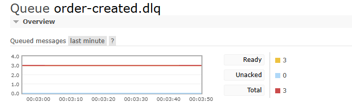

# AI-SERVICE TEST 기록

## 첫 번째 테스트
- `Commit Code` - d7895990cd6d03d64d6091e1f607a102b94ae065
- `Commit Name` - feat: 일단 현재 흐름 저장 / 내부 우리 서비스 안켜져있으면 호출 실패 이력 저장안되는거 확인함 수정예정

Postman 테스트
- `url` : http://localhost:15672/api/exchanges/%2F/order.exchange/publish
- `Authorization` : Basic Auth / Username = guest / Password = guest
- `Headers` : `Content-Type` : application/json , `Accept`: application/json

- `RequestBody`
``` json
{
    "properties": {
        "content_type": "application/json"
    },
    "routing_key": "order-created.queue",
    "payload": "{\"orderId\":\"11111111-1111-1111-1111-111111111111\",\"deliveryId\":\"22222222-2222-2222-2222-222222222222\",\"productId\":\"33333333-3333-3333-3333-333333333333\",\"quantity\":2,\"request\":\"오후 3시까지 배송해주세요\",\"receiverName\":\"홍길동\",\"receiverSlackId\":\"U123456\",\"createdAt\":\"2026-08-10T14:30:00\"}",
    "payload_encoding": "string"
}
```

테스트 결과

### 1. Queue order-created.dlq


- Postman으로 이벤트 발행 3번 하고 총 dlq에 쌓인 이벤트 3개
- maxRetries(2) 로 최초 요청 1회 + 2회로 총 3회
- 호출 흐름 분석
```
1. OrderCreatedEvent 수신 [OrderCreatedEventListner.java:handle()]
2. generate(event) 실행
3. deliveryPort.getRoutes(event.deliveryId()) 로 Delivery Service 호출
4. Delivery Service 를 켜두지 않아서 유레카에서 등록된 서비스를 못찾았으므로 500 대 에러 발생
5. 여기서 문제는 AiHistory를 만드는 코드가 generate() 메서드 맨 아래에 있음.
6. 즉, 모든 서비스에서 내부 API 호출이 실패하면 AiHistory 실패 이력이 저장되지 않음.
7. 저장은 되지 않으나, dlq에 이벤트가 쌓이는건 확인
```

### 2. Error Log
```
2026-08-10T14:32:34.901Z  INFO 1 --- [ai-service] [ntContainer#0-1] c.l.a.i.m.OrderCreatedEventListener      : [AI-SERVICE] OrderCreatedEvent 수신, orderId = 11111111-1111-1111-1111-111111111111

2026-08-10T14:32:34.901Z  INFO 1 --- [ai-service] [ntContainer#0-1] c.l.a.a.facade.DispatchDeadlineFacade    : [AI-SERVICE]: OrderCreatedEvent 수신, orderId = 11111111-1111-1111-1111-111111111111, deliveryId = 22222222-2222-2222-2222-222222222222

2026-08-10T14:32:34.979Z  WARN 1 --- [ai-service] [ntContainer#0-1] o.s.c.l.core.RoundRobinLoadBalancer      : No servers available for service: delivery-service

2026-08-10T14:32:34.982Z  WARN 1 --- [ai-service] [ntContainer#0-1] .s.c.o.l.FeignBlockingLoadBalancerClient : Load balancer does not contain an instance for the service delivery-service

2026-08-10T14:32:34.984Z ERROR 1 --- [ai-service] [ntContainer#0-1] c.l.a.i.m.OrderCreatedMessageRecover     : [AI-SERVICE]: OrderCreatedEvent 최종 처리 실패

org.springframework.amqp.rabbit.support.ListenerExecutionFailedException: Listener method 'public void com.logistics.ai.infrastructure.messaging.OrderCreatedEventListener.handle(com.logistics.ai.application.event.OrderCreatedEvent)' threw exception

	at org.springframework.amqp.rabbit.listener.adapter.MessagingMessageListenerAdapter.invokeHandler(MessagingMessageListenerAdapter.java:331) ~[spring-rabbit-4.1.0.jar!/:4.1.0]

	at org.springframework.amqp.rabbit.listener.adapter.MessagingMessageListenerAdapter.invokeHandlerAndProcessResult(MessagingMessageListenerAdapter.java:266) ~[spring-rabbit-4.1.0.jar!/:4.1.0]

	at org.springframework.amqp.rabbit.listener.adapter.MessagingMessageListenerAdapter.onMessage(MessagingMessageListenerAdapter.java:184) ~[spring-rabbit-4.1.0.jar!/:4.1.0]

	at org.springframework.amqp.rabbit.listener.AbstractMessageListenerContainer.doInvokeListener(AbstractMessageListenerContainer.java:1691) ~[spring-rabbit-4.1.0.jar!/:4.1.0]

	at org.springframework.amqp.rabbit.listener.AbstractMessageListenerContainer.actualInvokeListener(AbstractMessageListenerContainer.java:1620) ~[spring-rabbit-4.1.0.jar!/:4.1.0]

	at java.base/jdk.internal.reflect.DirectMethodHandleAccessor.invoke(Unknown Source) ~[na:na]

	at java.base/java.lang.reflect.Method.invoke(Unknown Source) ~[na:na]

	at org.springframework.aop.support.AopUtils.invokeJoinpointUsingReflection(AopUtils.java:359) ~[spring-aop-7.0.8.jar!/:7.0.8]

	at org.springframework.aop.framework.ReflectiveMethodInvocation.invokeJoinpoint(ReflectiveMethodInvocation.java:190) ~[spring-aop-7.0.8.jar!/:7.0.8]

	at org.springframework.aop.framework.ReflectiveMethodInvocation.proceed(ReflectiveMethodInvocation.java:158) ~[spring-aop-7.0.8.jar!/:7.0.8]

	at org.springframework.core.retry.RetryTemplate.execute(RetryTemplate.java:135) ~[spring-core-7.0.8.jar!/:7.0.8]

	at org.springframework.amqp.rabbit.config.StatelessRetryOperationsInterceptor.invoke(StatelessRetryOperationsInterceptor.java:57) ~[spring-rabbit-4.1.0.jar!/:4.1.0]

	at org.springframework.aop.framework.ReflectiveMethodInvocation.proceed(ReflectiveMethodInvocation.java:179) ~[spring-aop-7.0.8.jar!/:7.0.8]

	at org.springframework.aop.framework.JdkDynamicAopProxy.invoke(JdkDynamicAopProxy.java:222) ~[spring-aop-7.0.8.jar!/:7.0.8]

	at org.springframework.amqp.rabbit.listener.$Proxy190.invokeListener(Unknown Source) ~[na:4.1.0]

	at org.springframework.amqp.rabbit.listener.AbstractMessageListenerContainer.invokeListener(AbstractMessageListenerContainer.java:1603) ~[spring-rabbit-4.1.0.jar!/:4.1.0]

	at org.springframework.amqp.rabbit.listener.AbstractMessageListenerContainer.doExecuteListener(AbstractMessageListenerContainer.java:1594) ~[spring-rabbit-4.1.0.jar!/:4.1.0]

	at org.springframework.amqp.rabbit.listener.AbstractMessageListenerContainer.executeListenerAndHandleException(AbstractMessageListenerContainer.java:1541) ~[spring-rabbit-4.1.0.jar!/:4.1.0]

	at org.springframework.amqp.rabbit.listener.AbstractMessageListenerContainer.executeListener(AbstractMessageListenerContainer.java:1522) ~[spring-rabbit-4.1.0.jar!/:4.1.0]

	at org.springframework.amqp.rabbit.listener.SimpleMessageListenerContainer.doReceiveAndExecute(SimpleMessageListenerContainer.java:1158) ~[spring-rabbit-4.1.0.jar!/:4.1.0]

	at org.springframework.amqp.rabbit.listener.SimpleMessageListenerContainer.receiveAndExecute(SimpleMessageListenerContainer.java:1103) ~[spring-rabbit-4.1.0.jar!/:4.1.0]

	at org.springframework.amqp.rabbit.listener.SimpleMessageListenerContainer$AsyncMessageProcessingConsumer.mainLoop(SimpleMessageListenerContainer.java:1511) ~[spring-rabbit-4.1.0.jar!/:4.1.0]

	at org.springframework.amqp.rabbit.listener.SimpleMessageListenerContainer$AsyncMessageProcessingConsumer.run(SimpleMessageListenerContainer.java:1405) ~[spring-rabbit-4.1.0.jar!/:4.1.0]

	at java.base/java.lang.Thread.run(Unknown Source) ~[na:na]

Caused by: tools.jackson.core.exc.StreamReadException: Unrecognized token 'Load': was expecting (JSON String, Number, Array, Object or token 'null', 'true' or 'false')

 at [Source: REDACTED (`StreamReadFeature.INCLUDE_SOURCE_IN_LOCATION` disabled); byte offset: #0]

	at tools.jackson.core.JsonParser._constructReadException(JsonParser.java:1856) ~[jackson-core-3.1.4.jar!/:3.1.4]

	at tools.jackson.core.json.UTF8StreamJsonParser._reportInvalidToken(UTF8StreamJsonParser.java:4240) ~[jackson-core-3.1.4.jar!/:3.1.4]

	at tools.jackson.core.json.UTF8StreamJsonParser._handleUnexpectedValue(UTF8StreamJsonParser.java:3312) ~[jackson-core-3.1.4.jar!/:3.1.4]

	at tools.jackson.core.json.UTF8StreamJsonParser._nextTokenNotInObject(UTF8StreamJsonParser.java:875) ~[jackson-core-3.1.4.jar!/:3.1.4]

	at tools.jackson.core.json.UTF8StreamJsonParser.nextToken(UTF8StreamJsonParser.java:761) ~[jackson-core-3.1.4.jar!/:3.1.4]

	at tools.jackson.databind.ObjectMapper._initForReading(ObjectMapper.java:2734) ~[jackson-databind-3.1.4.jar!/:3.1.4]

	at tools.jackson.databind.ObjectMapper._readMapAndClose(ObjectMapper.java:2629) ~[jackson-databind-3.1.4.jar!/:3.1.4]

	at tools.jackson.databind.ObjectMapper.readValue(ObjectMapper.java:1622) ~[jackson-databind-3.1.4.jar!/:3.1.4]

	at com.logistics.ai.infrastructure.config.FeignErrorDecoder.read(FeignErrorDecoder.java:71) ~[!/:0.0.1-SNAPSHOT]

	at com.logistics.ai.infrastructure.config.FeignErrorDecoder.decode(FeignErrorDecoder.java:29) ~[!/:0.0.1-SNAPSHOT]

	at feign.InvocationContext.decodeError(InvocationContext.java:133) ~[feign-core-13.6.1.jar!/:na]

	at feign.InvocationContext.proceed(InvocationContext.java:80) ~[feign-core-13.6.1.jar!/:na]

	at feign.ResponseHandler.handleResponse(ResponseHandler.java:69) ~[feign-core-13.6.1.jar!/:na]

	at feign.SynchronousMethodHandler.executeAndDecode(SynchronousMethodHandler.java:109) ~[feign-core-13.6.1.jar!/:na]

	at feign.SynchronousMethodHandler.invoke(SynchronousMethodHandler.java:53) ~[feign-core-13.6.1.jar!/:na]

	at feign.ReflectiveFeign$FeignInvocationHandler.invoke(ReflectiveFeign.java:104) ~[feign-core-13.6.1.jar!/:na]

	at jdk.proxy2/jdk.proxy2.$Proxy177.getRoutes(Unknown Source) ~[na:na]

	at com.logistics.ai.infrastructure.adapter.DeliveryAdapter.getRoutes(DeliveryAdapter.java:25) ~[!/:0.0.1-SNAPSHOT]

	at com.logistics.ai.application.facade.DispatchDeadlineFacade.generate(DispatchDeadlineFacade.java:57) ~[!/:0.0.1-SNAPSHOT]

	at com.logistics.ai.infrastructure.messaging.OrderCreatedEventListener.handle(OrderCreatedEventListener.java:28) ~[!/:0.0.1-SNAPSHOT]

	at java.base/jdk.internal.reflect.DirectMethodHandleAccessor.invoke(Unknown Source) ~[na:na]

	at java.base/java.lang.reflect.Method.invoke(Unknown Source) ~[na:na]

	at org.springframework.messaging.handler.invocation.InvocableHandlerMethod.doInvoke(InvocableHandlerMethod.java:168) ~[spring-messaging-7.0.8.jar!/:7.0.8]

	at org.springframework.amqp.listener.adapter.KotlinAwareInvocableHandlerMethod.doInvoke(KotlinAwareInvocableHandlerMethod.java:47) ~[spring-amqp-4.1.0.jar!/:4.1.0]

	at org.springframework.messaging.handler.invocation.InvocableHandlerMethod.invoke(InvocableHandlerMethod.java:119) ~[spring-messaging-7.0.8.jar!/:7.0.8]

	at org.springframework.amqp.listener.adapter.HandlerAdapter.invoke(HandlerAdapter.java:85) ~[spring-amqp-4.1.0.jar!/:4.1.0]

	at org.springframework.amqp.rabbit.listener.adapter.MessagingMessageListenerAdapter.invokeHandler(MessagingMessageListenerAdapter.java:322) ~[spring-rabbit-4.1.0.jar!/:4.1.0]

	... 23 common frames omitted

2026-08-10T14:32:34.988Z  WARN 1 --- [ai-service] [ntContainer#0-1] o.s.a.l.ConditionalRejectingErrorHandler : Execution of Rabbit message listener failed.


org.springframework.amqp.AmqpRejectAndDontRequeueException: OrderCreatedEvent 이벤트 재시도 횟수 소진

	at com.logistics.ai.infrastructure.messaging.OrderCreatedMessageRecover.recover(OrderCreatedMessageRecover.java:20) ~[!/:0.0.1-SNAPSHOT]

	at org.springframework.amqp.rabbit.config.StatelessRetryOperationsInterceptorFactoryBean.recover(StatelessRetryOperationsInterceptorFactoryBean.java:65) ~[spring-rabbit-4.1.0.jar!/:4.1.0]

	at org.springframework.amqp.rabbit.config.StatelessRetryOperationsInterceptor.invoke(StatelessRetryOperationsInterceptor.java:61) ~[spring-rabbit-4.1.0.jar!/:4.1.0]

	at org.springframework.aop.framework.ReflectiveMethodInvocation.proceed(ReflectiveMethodInvocation.java:179) ~[spring-aop-7.0.8.jar!/:7.0.8]

	at org.springframework.aop.framework.JdkDynamicAopProxy.invoke(JdkDynamicAopProxy.java:222) ~[spring-aop-7.0.8.jar!/:7.0.8]

	at org.springframework.amqp.rabbit.listener.$Proxy190.invokeListener(Unknown Source) ~[na:4.1.0]

	at org.springframework.amqp.rabbit.listener.AbstractMessageListenerContainer.invokeListener(AbstractMessageListenerContainer.java:1603) ~[spring-rabbit-4.1.0.jar!/:4.1.0]

	at org.springframework.amqp.rabbit.listener.AbstractMessageListenerContainer.doExecuteListener(AbstractMessageListenerContainer.java:1594) ~[spring-rabbit-4.1.0.jar!/:4.1.0]

	at org.springframework.amqp.rabbit.listener.AbstractMessageListenerContainer.executeListenerAndHandleException(AbstractMessageListenerContainer.java:1541) ~[spring-rabbit-4.1.0.jar!/:4.1.0]

	at org.springframework.amqp.rabbit.listener.AbstractMessageListenerContainer.executeListener(AbstractMessageListenerContainer.java:1522) ~[spring-rabbit-4.1.0.jar!/:4.1.0]

	at org.springframework.amqp.rabbit.listener.SimpleMessageListenerContainer.doReceiveAndExecute(SimpleMessageListenerContainer.java:1158) ~[spring-rabbit-4.1.0.jar!/:4.1.0]

	at org.springframework.amqp.rabbit.listener.SimpleMessageListenerContainer.receiveAndExecute(SimpleMessageListenerContainer.java:1103) ~[spring-rabbit-4.1.0.jar!/:4.1.0]

	at org.springframework.amqp.rabbit.listener.SimpleMessageListenerContainer$AsyncMessageProcessingConsumer.mainLoop(SimpleMessageListenerContainer.java:1511) ~[spring-rabbit-4.1.0.jar!/:4.1.0]

	at org.springframework.amqp.rabbit.listener.SimpleMessageListenerContainer$AsyncMessageProcessingConsumer.run(SimpleMessageListenerContainer.java:1405) ~[spring-rabbit-4.1.0.jar!/:4.1.0]

	at java.base/java.lang.Thread.run(Unknown Source) ~[na:na]

Caused by: org.springframework.amqp.rabbit.support.ListenerExecutionFailedException: Listener method 'public void com.logistics.ai.infrastructure.messaging.OrderCreatedEventListener.handle(com.logistics.ai.application.event.OrderCreatedEvent)' threw exception

	at org.springframework.amqp.rabbit.listener.adapter.MessagingMessageListenerAdapter.invokeHandler(MessagingMessageListenerAdapter.java:331) ~[spring-rabbit-4.1.0.jar!/:4.1.0]

	at org.springframework.amqp.rabbit.listener.adapter.MessagingMessageListenerAdapter.invokeHandlerAndProcessResult(MessagingMessageListenerAdapter.java:266) ~[spring-rabbit-4.1.0.jar!/:4.1.0]

	at org.springframework.amqp.rabbit.listener.adapter.MessagingMessageListenerAdapter.onMessage(MessagingMessageListenerAdapter.java:184) ~[spring-rabbit-4.1.0.jar!/:4.1.0]

	at org.springframework.amqp.rabbit.listener.AbstractMessageListenerContainer.doInvokeListener(AbstractMessageListenerContainer.java:1691) ~[spring-rabbit-4.1.0.jar!/:4.1.0]

	at org.springframework.amqp.rabbit.listener.AbstractMessageListenerContainer.actualInvokeListener(AbstractMessageListenerContainer.java:1620) ~[spring-rabbit-4.1.0.jar!/:4.1.0]

	at java.base/jdk.internal.reflect.DirectMethodHandleAccessor.invoke(Unknown Source) ~[na:na]

	at java.base/java.lang.reflect.Method.invoke(Unknown Source) ~[na:na]

	at org.springframework.aop.support.AopUtils.invokeJoinpointUsingReflection(AopUtils.java:359) ~[spring-aop-7.0.8.jar!/:7.0.8]

	at org.springframework.aop.framework.ReflectiveMethodInvocation.invokeJoinpoint(ReflectiveMethodInvocation.java:190) ~[spring-aop-7.0.8.jar!/:7.0.8]

	at org.springframework.aop.framework.ReflectiveMethodInvocation.proceed(ReflectiveMethodInvocation.java:158) ~[spring-aop-7.0.8.jar!/:7.0.8]

	at org.springframework.core.retry.RetryTemplate.execute(RetryTemplate.java:135) ~[spring-core-7.0.8.jar!/:7.0.8]

	at org.springframework.amqp.rabbit.config.StatelessRetryOperationsInterceptor.invoke(StatelessRetryOperationsInterceptor.java:57) ~[spring-rabbit-4.1.0.jar!/:4.1.0]

	... 12 common frames omitted

Caused by: tools.jackson.core.exc.StreamReadException: Unrecognized token 'Load': was expecting (JSON String, Number, Array, Object or token 'null', 'true' or 'false')

 at [Source: REDACTED (`StreamReadFeature.INCLUDE_SOURCE_IN_LOCATION` disabled); byte offset: #0]

	at tools.jackson.core.JsonParser._constructReadException(JsonParser.java:1856) ~[jackson-core-3.1.4.jar!/:3.1.4]

	at tools.jackson.core.json.UTF8StreamJsonParser._reportInvalidToken(UTF8StreamJsonParser.java:4240) ~[jackson-core-3.1.4.jar!/:3.1.4]

	at tools.jackson.core.json.UTF8StreamJsonParser._handleUnexpectedValue(UTF8StreamJsonParser.java:3312) ~[jackson-core-3.1.4.jar!/:3.1.4]

	at tools.jackson.core.json.UTF8StreamJsonParser._nextTokenNotInObject(UTF8StreamJsonParser.java:875) ~[jackson-core-3.1.4.jar!/:3.1.4]

	at tools.jackson.core.json.UTF8StreamJsonParser.nextToken(UTF8StreamJsonParser.java:761) ~[jackson-core-3.1.4.jar!/:3.1.4]

	at tools.jackson.databind.ObjectMapper._initForReading(ObjectMapper.java:2734) ~[jackson-databind-3.1.4.jar!/:3.1.4]

	at tools.jackson.databind.ObjectMapper._readMapAndClose(ObjectMapper.java:2629) ~[jackson-databind-3.1.4.jar!/:3.1.4]

	at tools.jackson.databind.ObjectMapper.readValue(ObjectMapper.java:1622) ~[jackson-databind-3.1.4.jar!/:3.1.4]

	at com.logistics.ai.infrastructure.config.FeignErrorDecoder.read(FeignErrorDecoder.java:71) ~[!/:0.0.1-SNAPSHOT]

	at com.logistics.ai.infrastructure.config.FeignErrorDecoder.decode(FeignErrorDecoder.java:29) ~[!/:0.0.1-SNAPSHOT]

	at feign.InvocationContext.decodeError(InvocationContext.java:133) ~[feign-core-13.6.1.jar!/:na]

	at feign.InvocationContext.proceed(InvocationContext.java:80) ~[feign-core-13.6.1.jar!/:na]

	at feign.ResponseHandler.handleResponse(ResponseHandler.java:69) ~[feign-core-13.6.1.jar!/:na]

	at feign.SynchronousMethodHandler.executeAndDecode(SynchronousMethodHandler.java:109) ~[feign-core-13.6.1.jar!/:na]

	at feign.SynchronousMethodHandler.invoke(SynchronousMethodHandler.java:53) ~[feign-core-13.6.1.jar!/:na]

	at feign.ReflectiveFeign$FeignInvocationHandler.invoke(ReflectiveFeign.java:104) ~[feign-core-13.6.1.jar!/:na]

	at jdk.proxy2/jdk.proxy2.$Proxy177.getRoutes(Unknown Source) ~[na:na]

	at com.logistics.ai.infrastructure.adapter.DeliveryAdapter.getRoutes(DeliveryAdapter.java:25) ~[!/:0.0.1-SNAPSHOT]

	at com.logistics.ai.application.facade.DispatchDeadlineFacade.generate(DispatchDeadlineFacade.java:57) ~[!/:0.0.1-SNAPSHOT]

	at com.logistics.ai.infrastructure.messaging.OrderCreatedEventListener.handle(OrderCreatedEventListener.java:28) ~[!/:0.0.1-SNAPSHOT]

	at java.base/jdk.internal.reflect.DirectMethodHandleAccessor.invoke(Unknown Source) ~[na:na]

	at java.base/java.lang.reflect.Method.invoke(Unknown Source) ~[na:na]

	at org.springframework.messaging.handler.invocation.InvocableHandlerMethod.doInvoke(InvocableHandlerMethod.java:168) ~[spring-messaging-7.0.8.jar!/:7.0.8]

	at org.springframework.amqp.listener.adapter.KotlinAwareInvocableHandlerMethod.doInvoke(KotlinAwareInvocableHandlerMethod.java:47) ~[spring-amqp-4.1.0.jar!/:4.1.0]

	at org.springframework.messaging.handler.invocation.InvocableHandlerMethod.invoke(InvocableHandlerMethod.java:119) ~[spring-messaging-7.0.8.jar!/:7.0.8]

	at org.springframework.amqp.listener.adapter.HandlerAdapter.invoke(HandlerAdapter.java:85) ~[spring-amqp-4.1.0.jar!/:4.1.0]

	at org.springframework.amqp.rabbit.listener.adapter.MessagingMessageListenerAdapter.invokeHandler(MessagingMessageListenerAdapter.java:322) ~[spring-rabbit-4.1.0.jar!/:4.1.0]

	... 23 common frames omitted
```
